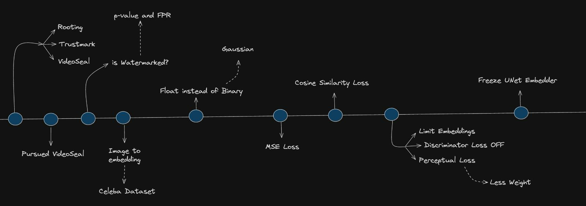

# BiometricSEAL

Embedding biometric information inside human‐generated content (images) using imperceptible watermarking techniques.


---

## 📚 Dataset

This project uses the following dataset to train and evaluate the embedding and extraction pipelines:

- **Dataset name**: Segment Anything 1 Billion (SA-1B)  
- **Download link**: https://ai.meta.com/datasets/segment-anything/


> ⚠️ Please download and extract the dataset before running any of the scripts in this repository. Place the unzipped folder under `data/` (or update paths in the config files accordingly).

---

## 🔄 Load Custom Checkpoints

Before running inference, make sure to load your trained model weights:


1. **Clone the repository**

```bash
git clone https://github.com/anoushkrit/BiometricSEAL.git
cd BiometricSEAL
```

2. **Install dependencies**

```bash
pip install -r requirements.txt
```

3. **Create the checkpoints directory**  
```bash
cd videoseal/finalOutput/
mkdir -p checkpoints
```

4. **Download the pretrained model weights**  
   - Download the model weights under the Releases section and place them in the `checkpoints` directory.


5. **Run the inference script**
    
```bash
cd ../../notebooks
jupyter notebook image_inference.ipynb
```

## 🗓️ Timeline

Below is a summary of the work we’ve done over the past four months:



